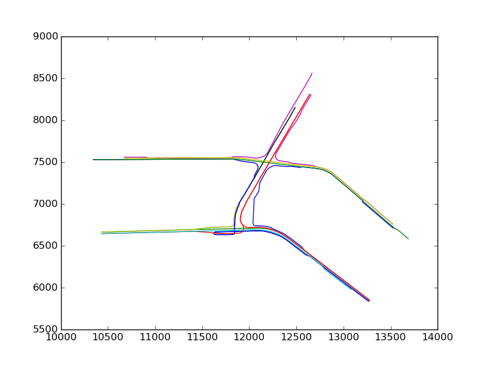

Junction Traffic Trajectory Data
=======================
*A collection of trajectories generated from small-scale junction traffic simulations.*

Simulation software: [SUMO](http://www.dlr.de/ts/en/desktopdefault.aspx/tabid-9883/16931_read-41000/)

Map data: [OpenStreetMap](http://www.openstreetmap.org/)  

-----------------------------

### What's in here?

Each subdirectory `regionXX/` contains the trajectory data for a 
1-hour traffic simulation on one or more adjacent junctions.  
Periodic traffic flows are generated 
on a set of predefined routes within the scene. The routes can be 
previewed in `images/`. 

#### Trajectory files  

Trajectory files are stored in pdf format. They have the following 
naming convention:
	
	[regionXX].pbf

is the dense trajectory with sampling rate 1 sample per second.

	[regionXX]-ss[subsample]-n[noise].pbf

is the sub-sampled trajectories with sampling interval = `subsample`, 
and a Guassian measurement error with standard 
deviation = `noise-stdev`. 

#### Lane files

Every trajectory file is associated with a lane file that contains
some meta data about where the trajectory is on the map. Lane
files use the same naming convention as the trajectory files:

	[regionXX].lane
	[regionXX]-ss[subsample]-n[noise].lane

Lane files are plain text files. Each line represents a trajectory
and has the following format.

	[id] [trip_name] [segment00] [segment01] ....

- `id` is an unique identifier of the corresponding trajectory (ranges from 0 to arbitrary large integer).

- `trip_name` follows SUMO's naming convention `[route_id].[period_id]` 
to identify the route that the trajectory is sampled from.  
e.g. '11.5' means the 5th trajectory on the 11th route.

- `segmentXX` is id of the road segment on which the trajectory is sampled from. 
The segment ids are consistent with the Open Street Map.  

#### Map files

Map data in .osm format are stored in `osm/`.

---------------------------------
### Where are the route files/network files?

Please contact me via email <yangli1@stanford.edu>

